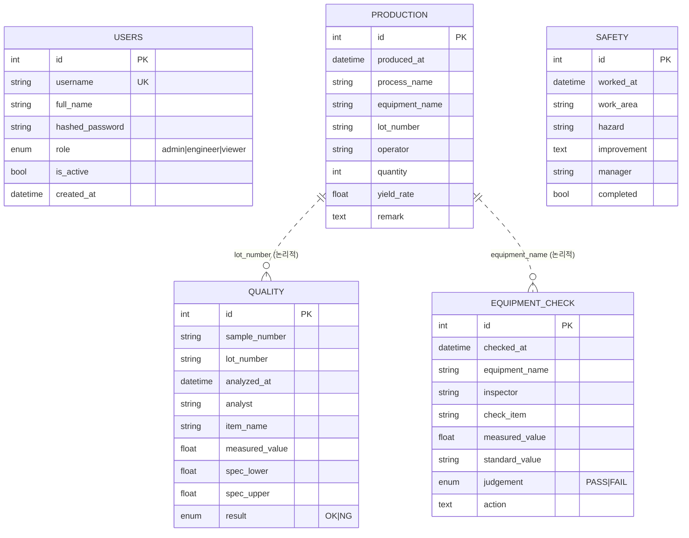

# 2. ERD (개체-관계 다이어그램)

## 2.1 개념

각 데이터 카테고리는 독립 테이블입니다. `lot_number`(LOT 번호)가 생산 ↔ 품질을
논리적으로 연결하는 **공통 키**이며, `equipment_name`(설비명)이 생산 ↔ 설비점검을
연결하는 논리 키입니다. (운영 단순화를 위해 물리적 FK 대신 자연키로 조인)

## 2.2 관계 요약

| 관계 | 연결 키 | 설명 |
|------|---------|------|
| 생산 ─ 품질 | `lot_number` | 한 LOT 에 대해 여러 품질 분석 |
| 생산 ─ 설비점검 | `equipment_name` | 한 설비에서 여러 생산/점검 |
| 사용자 | 독립 | 인증·권한 전용 |
